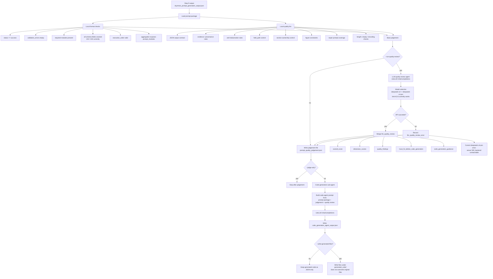

# Step 10 Prompt Quality And Code Agent Flow



## Current Status

- Local format checks: passed.
- Local quality lint: passed.
- Field coverage: `104 / 104`.
- `deepseek-v4` maps to `deepseek-v4-pro`, but the API currently returns server `500` for that model.
- `kimi-k2.6` passed the minimal `/chat/completions` test and is currently the usable model.

## Main Commands

Local judgement only:

```powershell
python code\prompt_quality_code_agent.py `
  --prompt-output skyrmion_prompt_generation_output.json `
  --judgement-output prompt_quality_judgement.json `
  --judge-only
```

Judgement plus LLM quality review:

```powershell
$env:CODE_AGENT_API_KEY="your-key"
python code\prompt_quality_code_agent.py `
  --prompt-output skyrmion_prompt_generation_output.json `
  --judgement-output prompt_quality_judgement.json `
  --judge-only `
  --run-quality-review `
  --base-url https://chat.iphy.ac.cn/litellm/v1 `
  --model kimi-k2.6
```

Full judgement plus code-generation sub-agent:

```powershell
$env:CODE_AGENT_API_KEY="your-key"
python code\prompt_quality_code_agent.py `
  --prompt-output skyrmion_prompt_generation_output.json `
  --judgement-output prompt_quality_judgement.json `
  --code-agent-output code_generation_agent_output.json `
  --run-quality-review `
  --base-url https://chat.iphy.ac.cn/litellm/v1 `
  --model kimi-k2.6
```
